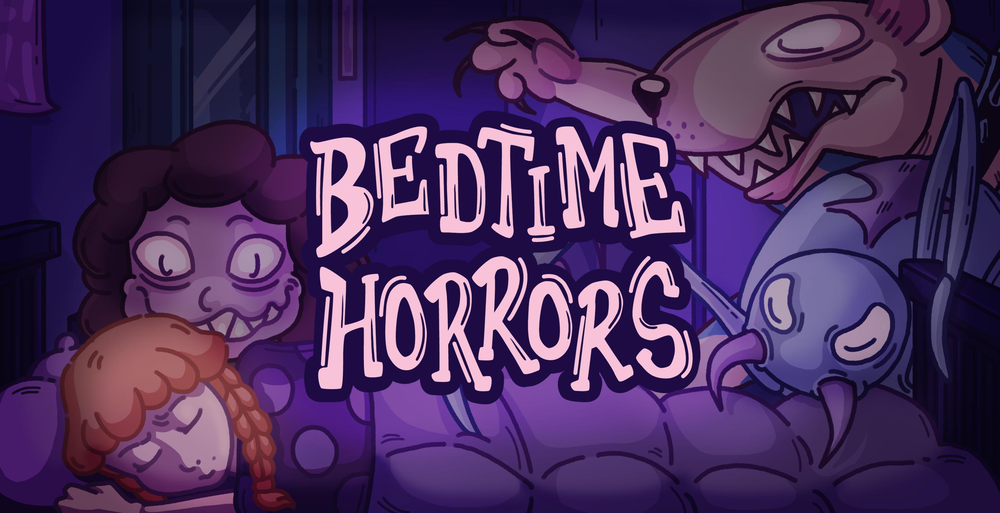

# Bedtime Horrors

When night falls, her fears return to haunt her room. Sleep stopped being a refuge long ago - every time she closes her eyes, nightmares try to drag her into the darkness. But she’s not alone. Her toys, Ms. Rosie, Tanky, and Nino, will come to life within her dreams to protect her, standing between her and the shadows.

This is a game being developed by students from <a href="https://www.imagecampus.edu.ar/">Image Campus</a>

   

## Credits

- **Sofía Álvarez Franzé** - *Programming*
- **Nicolas Leon** - *Programming*
- **Milagro García Gubert** - *Art*
- **Franco Gigena** - *Art*
- **Alexa Laborero** - *Art*
- **Guido Heinzenknecht** - *Audio*
- **Francisco Laiuppa** - *Audio*
- **Ignacio Lassaga** - *Audio*
- **Iván Alzari** - *QA*
- **Camila Gonella** - *QA*
- **Marco Lóndero** - *QA*
- **Franco Ripari** - *QA*
- **Emmanuel Saavedra** - *QA*

This game was also possible thanks to the support of:

**Professors:**

- Sergio Baretto
- Ignacio Mosconi
- Ramiro Cabrera
- Eugenio Taboada
- Nazareno Rivero
- Silvina Lemos

**Teaching assistants:**

- Guido Tello
- Elisa Gonda
- Julián Tinao
- Nicolas Arias Calvo
- Melissa Villarruel

**and all Image Campus Staff!**

## Acknowledgements

- Lucas Anich
- Lautaro Quiroga

## Links

Download it from itch.io: [https://gensofi24.itch.io/bedtime-horrors](https://gensofi24.itch.io/bedtime-horrors)
